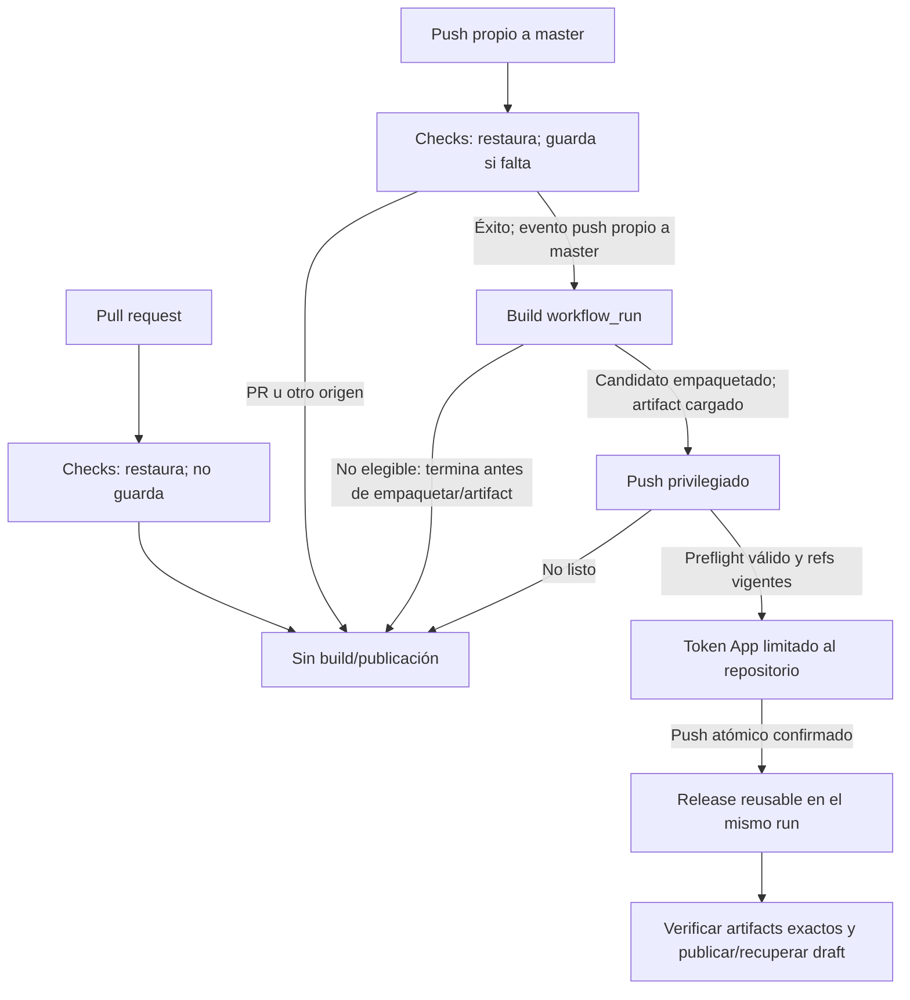
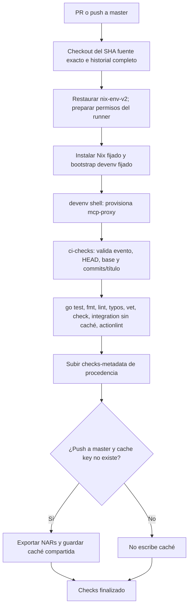
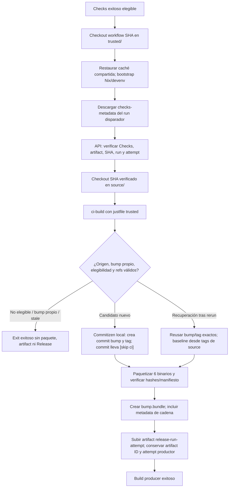
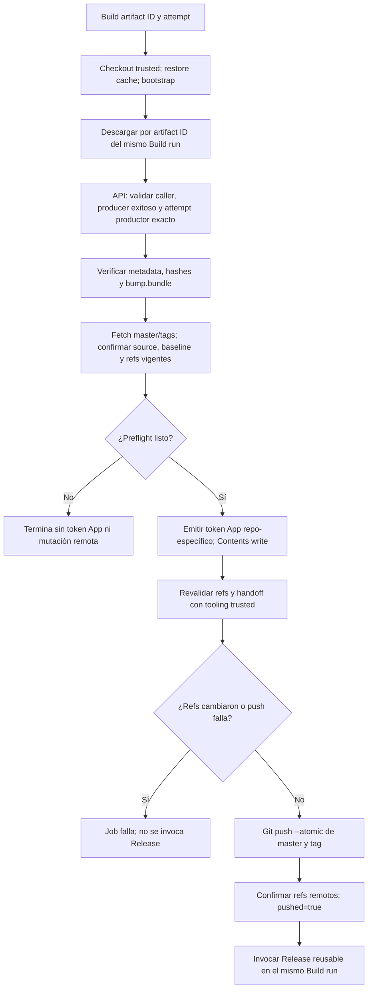
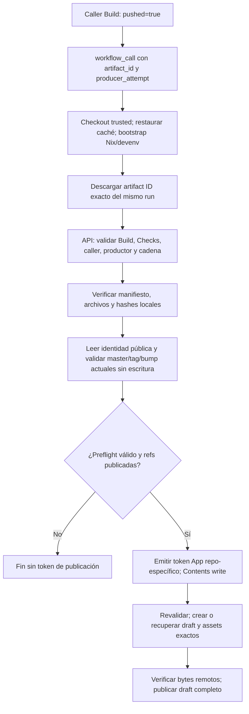

# Flujo actual de GitHub Actions

Este documento describe el orden implementado en `checks.yml`, `build.yml`,
`release.yml` y `justfile`. Los checks locales no verifican el comportamiento
real de `skip ci`, bypass de reglas, caché o artifacts en GitHub alojado; eso
sigue pendiente de una ejecución autorizada.

## Cadena

Checks valida el SHA exacto, commits/título y calidad; sube metadata de
procedencia. El Build se dispara con `workflow_run`, pero solo su job corre si
Checks fue exitoso y provino de un `push` propio a `master`. Antes de empaquetar,
Build verifica por API el run y artifact de Checks; usa tooling del checkout
confiable (`trusted/`) y compila el SHA fuente en `source/`.

Si no hay `feat`/`fix`, no hay versión nueva, o el commit es el bump propio
canónico, Build termina sin empaquetar candidato publicable. Para un candidato,
Build calcula la versión, crea localmente el commit/tag de bump con sufijo
`[skip ci]` y empaqueta seis binarios ligados al SHA fuente y a ese bump. Sube
el artifact al run/attempt productor. No obtiene token App durante la
compilación.

## Checks: validación y caché

El artifact metadata vincula SHA, repo, evento y run/attempt. Solo el push
exitoso a `master` guarda, y solo si no hubo cache hit exacto; PR siempre es
lector. `workflow_run` de Build filtra adicionalmente por éxito, `push`, rama
`master` y repo propio antes de asignar runner.

## Build: validación, candidato y artifact inerte

El commit/tag creado es local al runner: hasta terminar upload, ningún ref
remoto cambia. El bundle es handoff de objetos Git, no código ejecutable. El
job `push` solo depende de Build/artifact exitoso y elegible; una omisión de
elegibilidad no crea artifact de release ni invoca Release.

## Push: preflight sin escritura, luego refs atómicos

El productor es el run que subió el artifact, no necesariamente el intento
actual del caller reejecutado. API confirma producer exitoso y artifact
perteneciente al ID/run/attempt retenidos; el caller puede estar `in_progress`,
porque Release corre como parte de ese mismo Build. Si el push atómico falla,
Release no corre y no se publica parcialmente solo uno de los refs.

## Release reusable: publicar bytes ya asociados a refs

Release no ejecuta Commitizen, no crea bump/tag y no hace `git push`. Su
reintento usa el mismo artifact del productor; recupera un draft/asset parcial
si los refs siguen válidos. Para Build reintentado, `ci-build` conserva el
baseline derivado de tags alcanzables desde el SHA fuente y recupera el bump
ya publicado, evitando una versión duplicada.

El job `push` separado valida API, artifact y refs actuales sin credencial de
escritura. Solo después del preflight obtiene un token GitHub App limitado a
este repositorio y `Contents: write`, vuelve a validar y hace push atómico de
los objetos verificados. Release se invoca mediante `workflow_call` dentro del
mismo workflow Build únicamente si el push terminó con `pushed=true`; no tiene
disparador ni concurrencia independiente. Recibe explícitamente solo la clave
privada necesaria para emitir su propio token de App, valida de nuevo la
procedencia y descarga por ID el artifact exacto del run y attempt productor.
No ejecuta Commitizen ni crea commits/tags/push. Publica o recupera un draft
parcial verificando los bytes de los assets.

La concurrencia es única por repositorio en el caller Build y no cancela
publicaciones en curso. Si falla la publicación parcial, reintenta el mismo
Build; si se reejecuta el productor, recupera el bump/ref exacto de esa fuente
en vez de calcular otra versión. Un candidato obsoleto no se autoriza con un
reintento de Release antiguo: hacen falta Checks y Build nuevos para el `master`
actual.

## `skip ci`, permisos y bypass

El sufijo `[skip ci]` del commit de bump evita iniciar otra ejecución
normal de Checks. GitHub puede dejar en pendiente los checks requeridos cuando
se omite el workflow; no se debe depender de ese commit como único mecanismo
para satisfacer una regla de protección. El reconocimiento estructural del
bump propio en Checks es un fallback seguro si el workflow llega a ejecutarse,
no una omisión de validación basada solo en el texto del mensaje.

Los workflows comienzan con permisos mínimos: `contents: read` y `actions:
read` donde se requiere leer APIs/artifacts. Solo los jobs privilegiados
`push` y `release` solicitan cada uno su token App repositorio-específico y
`Contents: write`, tras su preflight sin escritura. Las credenciales estándar
de checkout no persisten; no se pasa `secrets: inherit`.

Prerequisitos para publicar: instalar la App en el repositorio con
`Contents: write`; definir `RELEASE_APP_CLIENT_ID`, secreto
`RELEASE_APP_PRIVATE_KEY` y variable pública `RELEASE_BOT_SLUG`. Si ruleset o
protección de `master` impide el push de la App, un administrador debe
configurar el bypass correspondiente para la identidad de la App. Eso es una
configuración externa obligatoria; este workflow no la crea ni la verifica
antes de una ejecución alojada.

## Caché NAR compartida

Checks, Build y Release restauran `nix-env-v2` con OS, arquitectura y hash de
`devenv.nix`, `devenv.yaml` y `devenv.lock` (Build/Release usan `trusted/`).
Solo Checks guarda, después de un push exitoso a `master`, y solo si la clave
no existe. Pull requests, Build y Release son lectores. Es una caché de NAR,
no un `/nix/store` compartido; caché fría debe funcionar. Cada entrada a
`devenv shell` sigue provisionando `mcp-proxy` por separado. La reutilización
entre workflows y runners alojados aún no está confirmada.

## Mantenibilidad pendiente

- Consolidar el gate duplicado de Checks sin perder integración sin caché ni actionlint.
- Separar la provisión Python de los entornos de packaging/publicación.
- Reducir duplicaciones en recetas/fixtures y tests acoplados a strings de YAML.
- Valorar un smoke alojado de Actions para Skip CI, caché y reintentos reutilizables.

Estas mejoras quedan fuera de esta fase; no se retiran controles de procedencia
ni recuperación para simplificar el flujo.
